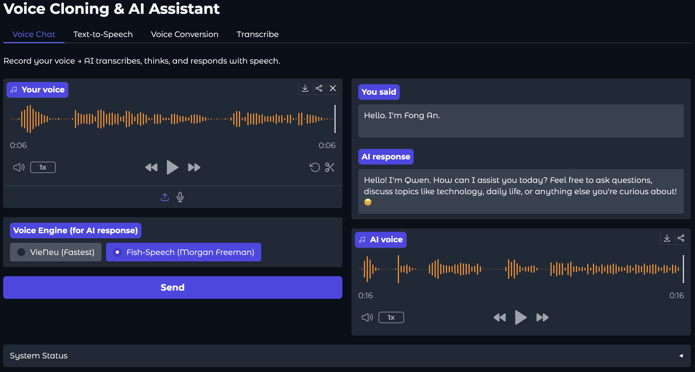
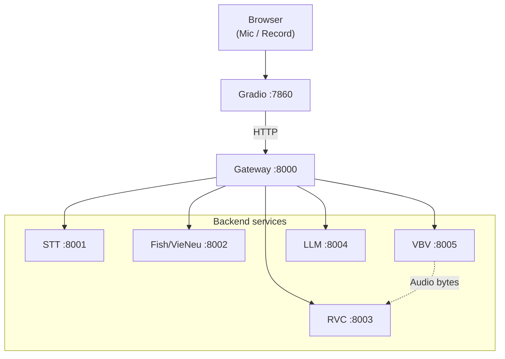

# Fiona Anne

Self-hosted voice conversational AI. Zero external APIs required.

## Table of contents

- [Fiona Anne](#fiona-anne)
  - [Table of contents](#table-of-contents)
  - [Demo](#demo)
    - [Bundled timbre](#bundled-timbre)
  - [Tech Stack](#tech-stack)
  - [Architecture](#architecture)
    - [Pipelines](#pipelines)
  - [Requirements](#requirements)
  - [Usage](#usage)
    - [API](#api)
    - [Scripts](#scripts)
    - [Dev](#dev)
  - [Google Colab](#google-colab)
  - [Docker](#docker)

## Demo

**Assistant:** **Google Gemma 4** via [Ollama](https://ollama.com) + [Anything-LLM](https://github.com/Mintplex-Labs/anything-llm).



**Voice cloning:** short reference clip -> speech in that timbre.

<video src="https://github.com/user-attachments/assets/e8035025-0739-4137-bb95-1ebb46e5b46c" controls width="100%"></video>

### Bundled timbre

**Phương Anh** (my special friend; personal recording for this repo, with permission).

Your own clip: paths and transcript in `.env` (see [`.env.example`](.env.example)).

## Tech Stack

| Layer | Technology |
| --- | --- |
| STT | [SYSTRAN/faster-whisper](https://github.com/SYSTRAN/faster-whisper) |
| TTS | [fishaudio/fish-speech](https://github.com/fishaudio/fish-speech) + [pnnbao97/VieNeu-TTS](https://github.com/pnnbao97/VieNeu-TTS) (VN) + [microsoft/VibeVoice](https://github.com/microsoft/VibeVoice) (EN) |
| Voice Conversion | [IAHispano/Applio](https://github.com/IAHispano/Applio) (RVC) |
| LLM | [Gemma 4](https://ai.google.dev/gemma) via [Ollama](https://ollama.com) + [Anything-LLM](https://github.com/Mintplex-Labs/anything-llm) |
| Backend | [FastAPI](https://github.com/fastapi/fastapi) + [Pydantic](https://github.com/pydantic/pydantic) |
| Frontend | [Gradio](https://github.com/gradio-app/gradio) |

## Architecture



### Pipelines

| Flow | Gateway | Notes |
| --- | --- | --- |
| LLM only | `/llm/chat` | JSON `{"message": "..."}` -> assistant text (proxied to `:8004`) |
| Conversation (one shot) | `/chat` | `Mic -> STT -> LLM -> TTS -> WAV`. E.g. `make chat_sample`, `api_client.chat()` |
| Voice Chat (Gradio) | `/transcribe` + `/llm/chat` + `/tts/*` | Same stages as `/chat`, split for progress UI; auto-routes to VieNeu or VBV based on language |
| Voice cloning | `/tts/fish-speech`, `/tts/vieneu` | `Text + ref audio + ref_text -> TTS -> WAV` (Zero-shot) |
| Voice conversion | `/convert-voice` | `Audio -> RVC -> WAV` OR `Text -> VBV -> RVC -> WAV` (Speed/Quality hybrid) |
| Transcribe | `/transcribe` | `Audio -> STT -> text` |

## Requirements

- [Miniforge](https://github.com/conda-forge/miniforge) + `ffmpeg`
- [Ollama](https://ollama.com) (`ollama pull gemma4` for Gemma 4) + [Anything-LLM](https://anythingllm.com) (workspace uses that model)

## Usage

```bash
conda activate voice
make help        # list all commands
make run_all     # start Gateway + STT + TTS + VBV + RVC + LLM
make run_ui      # Gradio at :7860
make health      # check all services
```

Run all system components simultaneously (make sure you installed all weights):

```bash
make run_all
```

### API

```bash
curl http://localhost:8000/health

# Run chat pipeline
curl -X POST http://localhost:8000/chat \
    -F "audio=@data/chunks/speech_chunk_0001.wav" -o response.wav

curl -X POST http://localhost:8000/transcribe \
    -F "audio=@data/chunks/speech_chunk_0001.wav"

curl -X POST http://localhost:8000/tts/vieneu \
    -F "text=Xin chào!" \
    -F "ref_audio=@data/raw/reference.wav" \
    -F "ref_text=Exact transcript of the reference audio" \
    -o output_vi.wav

curl -X POST http://localhost:8000/tts/vbv \
    -F "text=Hello from VBV!" \
    -o output_en.wav

curl -X POST http://localhost:8000/convert-voice \
    -F "audio=@output_en.wav" \
    -F "voice_model=target" \
    -o output_converted.wav
```

> VieNeu: `ref_text` must match the reference audio exactly. Omitting it degrades cloning quality significantly.

### Scripts

```bash
# Convert mp3/m4a -> wav (batch, before using as reference audio)
make convert_audio

# Test infer directly on modules
python scripts/tts_infer.py \
    --text "Hello, this is a voice cloning test." \
    --ref data/chunks/speech_chunk_0001.wav \
    --ref-text "Transcript of your reference audio clip."
python scripts/vieneu_infer.py --text "Xin chào!"
```

### Dev

```bash
make check    # ruff format + lint
```
## Google Colab

[](https://colab.research.google.com/github/singswap/voice-cloning/blob/main/Voice_Colab.ipynb)

## Docker

Docker Compose **`tts`** is **VieNeu-only** (`TTS_ENGINES=vieneu`), **fish-speech:** `make run_tts`, Colab, or TTS outside that container.

```bash
cp .env.example .env   # fill in ANYTHING_LLM_API_KEY
docker compose up --build

# CUDA (cloud)
docker compose -f docker-compose.yml -f docker-compose.gpu.yml up --build -d
```

```bash
docker compose ps
docker compose logs -f gateway
docker compose restart tts
docker compose down
```
